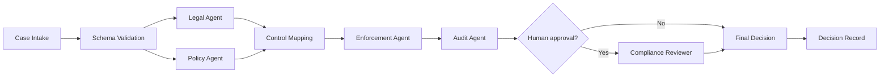
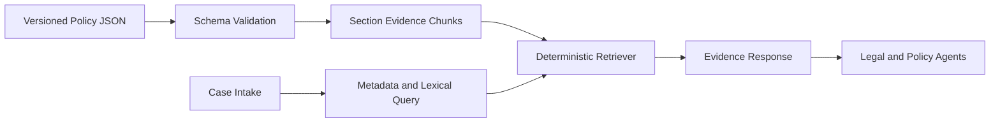
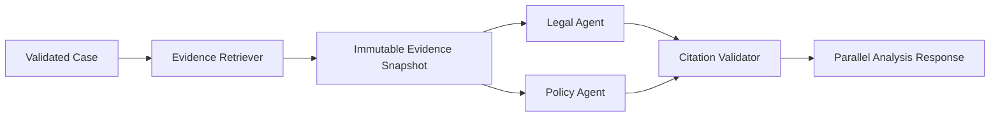
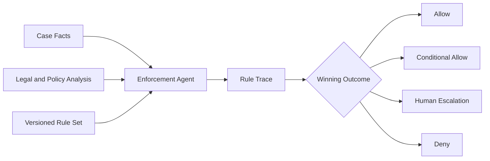
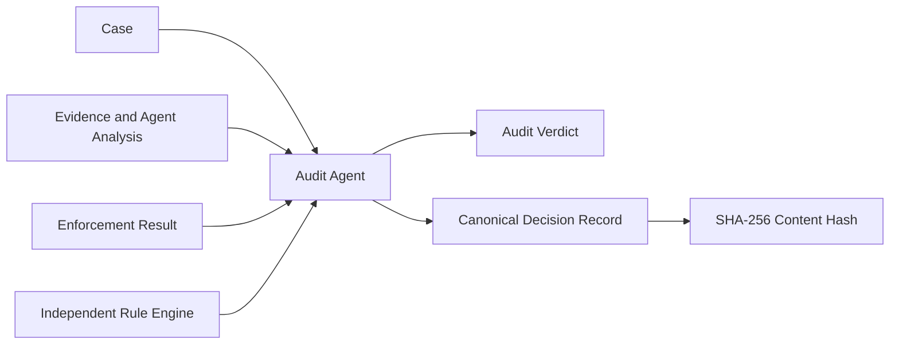

# Architecture

The assistant follows a controlled manager workflow:

1. Intake validates and normalizes an AI product launch case.
2. Legal and Policy agents analyze the case in parallel.
3. Their structured findings are mapped into enforceable controls.
4. The Enforcement agent evaluates deterministic policy rules.
5. The Audit agent independently reviews the evidence and decision.
6. High-risk or uncertain cases are escalated to a human reviewer.
7. Every input, finding, policy version, decision, and override is recorded.

Agent outputs will use strict schemas and evidence references. The language model
may identify and explain requirements, but deterministic rules or authorized
humans own final enforcement actions.

## Decision Flow

## Contract Boundary

- `CaseIntake` is the only accepted input to orchestration.
- `AgentFinding` is the shared evidence-bearing analysis unit.
- `ControlRequirement` translates findings into verifiable action.
- `ComplianceDecision` is the final versioned workflow result.
- Schema validation happens before and after every agent handoff.

## Evidence Layer

The Week 2 retriever is intentionally deterministic. It exposes scoring reasons
and preserves exact policy section text, allowing future embedding retrieval to
be evaluated against a transparent baseline.

## Parallel Analysis Layer

Legal and Policy agents run independently against the same evidence snapshot.
They cannot query unversioned sources during analysis. Findings that cannot cite
an exact retrieved section are rejected, while missing evidence is represented
as an explicit abstention.

## Enforcement Layer

The enforcement layer is deterministic and does not invoke a language model.
It applies explicit rule priorities, requires supporting analysis categories,
and records every evaluated predicate and input fact.

## Audit Layer

The Audit Agent validates lineage and independently replays enforcement. The
resulting content hash makes later changes detectable, while durable
immutability remains the responsibility of a future storage layer.
